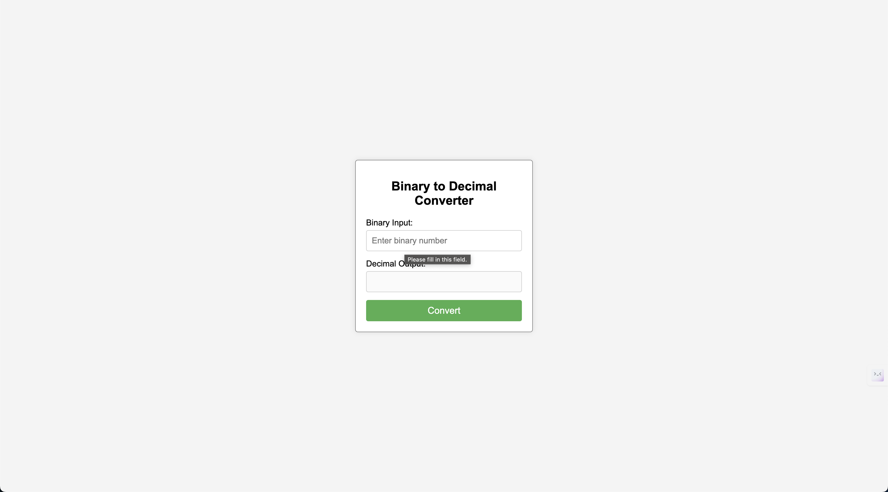

# B2D - Binary to Decimal Converter 

A simple web application to convert binary numbers to decimal format. This project demonstrates how to build a binary-to-decimal converter using plain HTML, CSS, and JavaScript.

## Features

- **Binary to Decimal Conversion:** Converts binary numbers to decimal.
- **Inline Error Feedback:** Provides specific feedback for invalid input directly below the input field.
- **Responsive Design:** Ensures the app is usable on various devices.

## Screenshots

## Usage
- Enter a binary number (only 0 and 1 are allowed) in the "Binary Input" field.
- Click the "Convert" button.
- The corresponding decimal number will appear in the "Decimal Output" field.
- If the input is invalid, an error message will be displayed below the input field.

## Example
- Input: 1010
- Output: 10

## Contributing
Contributions to this repository are welcome! If you have a code sample or topic you'd like to contribute, please follow these steps:

- Fork the repository
- Create a new branch (git checkout -b feature/new-topic)
- Make your changes
- Commit your changes (git commit -am 'Add new topic')
- Push to the branch (git push origin feature/new-topic)
- Create a new Pull Request

Please ensure your code adheres to the repository's coding standards and includes appropriate documentation/comments.
